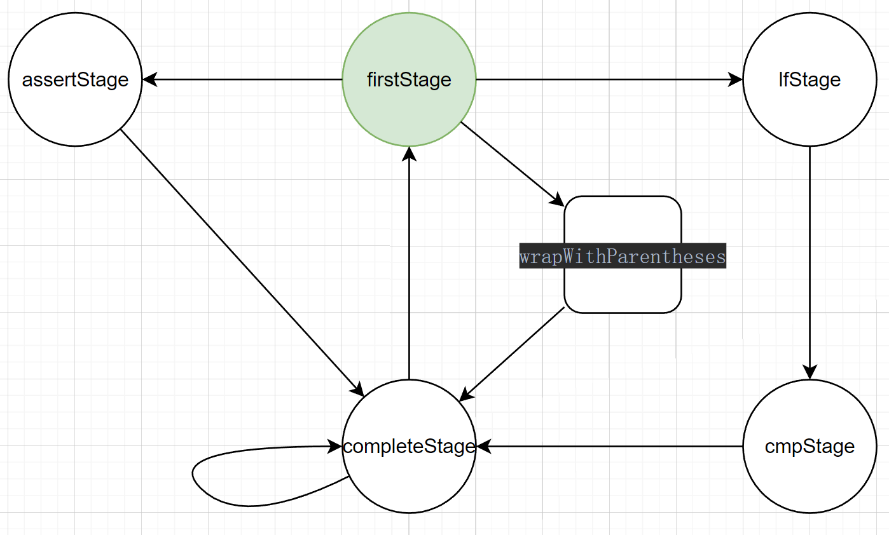

# SQL 动态条件生成库

A lightweight library specifically designed for dynamically generating SQL conditional statements on the backend. By accepting parameters from the frontend, the backend can efficiently construct SQL statements with complex conditions.
The core functionality is concentrated in firstStage, enabling the dynamic addition of conditional SQL statements to the final query through a flexible API.

一个轻量级的库，专为后端动态生成 SQL 条件语句而设计。通过前端传参，后端可以高效地生成包含复杂条件的 SQL 语句。
核心功能集中在 `Stage` 中，通过灵活的 API，轻松将满足条件的 SQL 动态语句。

## 功能特性

- **空值与特定条件处理**：自动处理空值。
- **动态条件生成**：根据前端传参动态生成 SQL 条件语句，支持多种操作符和复杂条件组合。
- **状态机驱动**：通过状态机设计，保证 SQL 条件的动态构建流程清晰且可控。
- **单例模式**：每种状态采用单例模式实现，减少资源开销。
- **灵活的条件组合**：支持 `AND`、`OR`、括号嵌套等复杂条件逻辑。


## 核心设计

### 状态机设计概览

核心功能围绕 `firstStage` 状态实现，动态将 SQL 条件根据特定逻辑组合到最终语句中。以下是状态机的设计图：



### 动态 SQL 条件示例

以下是动态 SQL 条件生成的典型使用示例：

#### 示例 1：

```scala
val value  = "test" 
println(where
  .LF ("name").==.&("").orCondition(LF("nike_name").==.&("jack")) //右值为空 添加orCondition条件
  .and
  .LF("age").==.$(18)
  .and
  .ASSERT_&("test", value).withCondition(LF("height").==.&("183cm")) //断言成功 添加withCondition条件
  .and
  .LF("id").in.&("10, 20 ,30")
  .and
  .wrapWithParentheses(
    LF("friend1").==.&("")
      .and
      .LF("friend2").==.&("tom")
  )
  .build
)
```

```sql
#结果
where nike_name == 'jack' and age == 18 and height == '183cm' and id in ('10', '20', '30') and  (friend2 == 'tom') 
```

```xml
<!--  加入依赖  -->
 <dependency>
    <groupId>com.wangy</groupId>
    <artifactId>sql_condition</artifactId>
    <version>1.0-SNAPSHOT</version>
</dependency>
```